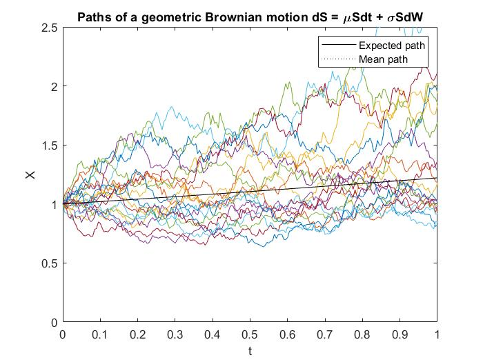
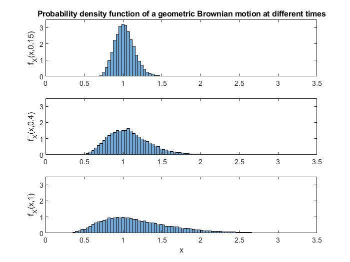
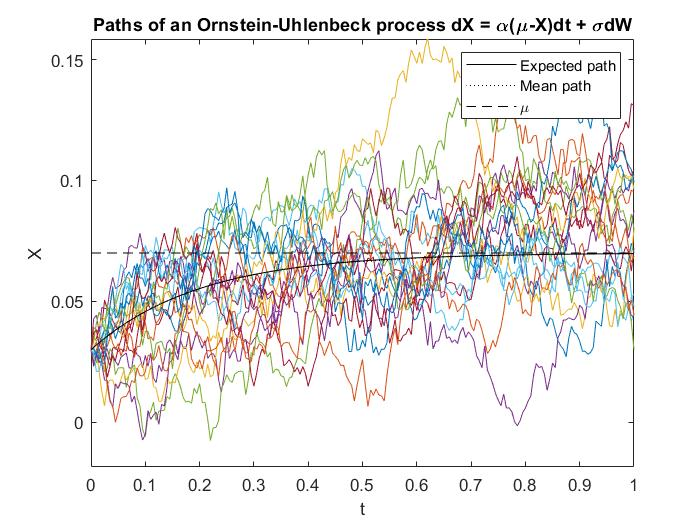
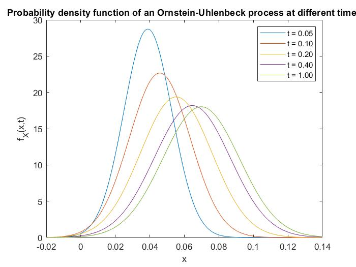
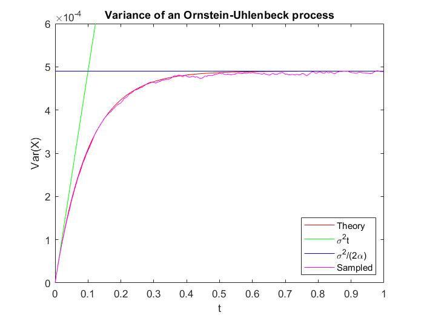
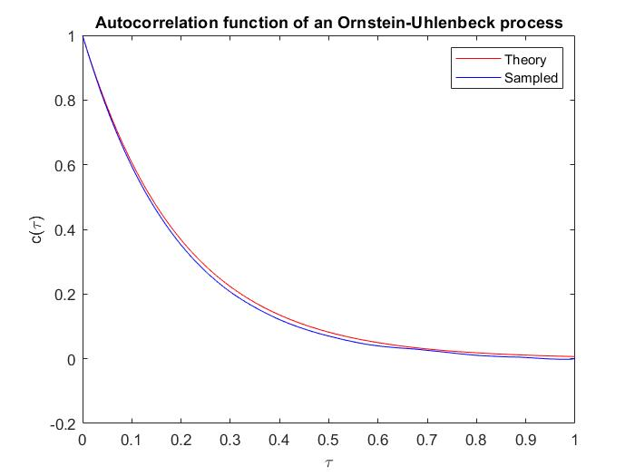
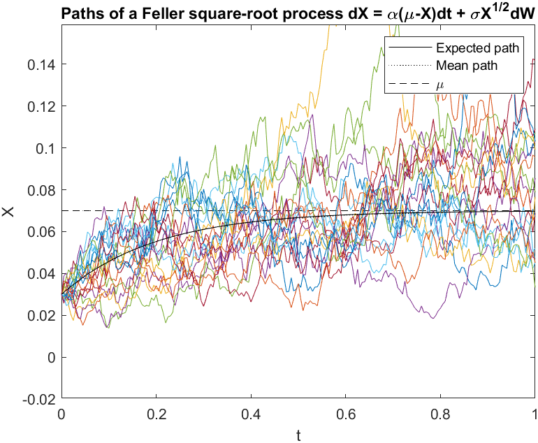
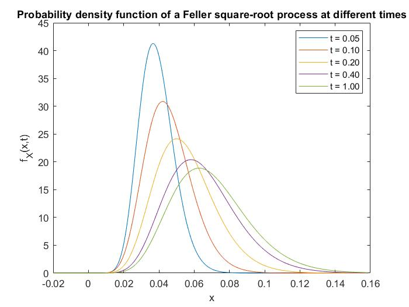
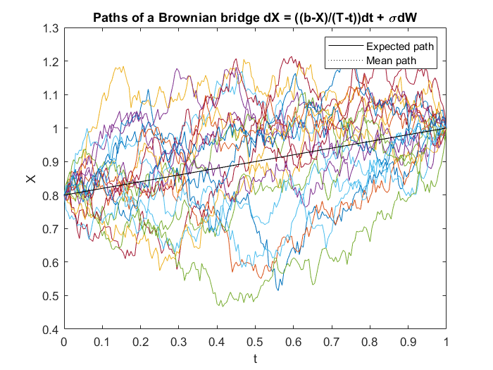

# stochastic-processes-in-Finance-
Modelling of some of the most popular stochastic processes in Finance: i) Geometric Brownian Motion; ii) Ornstein-Uhlenbeck process; iii) Feller-square root process and iv) Brownian Bridge.

## 1. Geometric Brownian motion 
A geometric Brownian motion (GBM) is a continuous-time stochastic process in which the logarithm of the random variables follows a Brownian motion (also called a Wiener process) with drift. It is an important example of stochastic processes satisfying a stochastic differential equation (SDE); in particular, it is used in mathematical finance to model stock prices in the Black–Scholes model.

A stochastic process  is said to follow a GBM if it satisfies the following stochastic differential equation (SDE): , where Wt is a Weiner process.

Some of the arguments for using GBM to model stock prices are:

- The expected returns of GBM are independent of the value of the process (stock price), which agrees with what we would expect in reality.
- A GBM process only assumes positive values, just like real stock prices.
- A GBM process assumes that the stock price follows a random walk process with a predictable component given by the drift.

However, GBM is not a completely realistic model, in particular it falls short of reality in the following points:
- In real stock prices, volatility changes over time, but in GBM, volatility is assumed constant. It can be adjusted using a stochastic volatility model.
- In real life, stock prices often show jumps caused by unpredictable events or news, but in GBM, the path is continuous (no discontinuity). It can be adjusted using stochastic processes with jumps.

### We have included Matlab code that does the following:
- Models GBM using the discretised Euler-Maruyama method
- Implemented Monte Carlo Simulations to generate various paths and take their mean. See fig below

- Plotted the probability density function of the GBM at different times. Random variable in a GBM model follows a log-normal distribution.

## 2. Ornstein-Uhlenbeck process (i.e. Vasicek Model)
 Ornstein-Uhlenbeck is a mean reverting process that is used in the Vasicek short interest rate model. The model specifies that the instantaneous interest rate follows the stochastic differential equation: 
 
 ,
 where  is the Brownian motion, , determines the volatility of the interest rate, b is "long term mean level" (i.e. all future trajectories of will evolve around a mean level b in the long run) and a is the "speed of mean reversion".
 
Vasicek's model was the first one to capture mean reversion, an essential characteristic of the interest rate that sets it apart from other financial prices. Thus, as opposed to stock prices for instance, interest rates cannot rise indefinitely. This is because at very high levels they would hamper economic activity, prompting a decrease in interest rates. Similarly, interest rates do not usually decrease below 0. As a result, interest rates move in a limited range, showing a tendency to revert to a long run value.

The main disadvantage is that, under Vasicek's model, it is theoretically possible for the interest rate to become negative, an undesirable feature under pre-crisis assumptions. This shortcoming was fixed in the Cox–Ingersoll–Ross model, exponential Vasicek model, Black–Derman–Toy model and Black–Karasinski model, among many others. The Vasicek model was further extended in the Hull–White model. 

### We have included Matlab code that does the following:
- Models OU process using the discretised Euler-Maruyama method
- Implemented Monte Carlo Simulations to generate various paths and take their mean. 

- Plotted the probability density function of the OU at different times. 

- Plotted the asymptotic and theoretical variance vs. sampled variance.
 
- Plotted theoretical vs. sampled autocorrelation function.
 

## 3. Feller square root process 
Has wide applications in financial mathematics. for instance it is used in the Cox-Ingersoll-Ross short-rate model and in the Heston stochastic volatility model.
In mathematical finance, the Cox–Ingersoll–Ross (CIR) model describes the evolution of interest rates. It is a type of "one factor model" (short-rate model) as it describes interest rate movements as driven by only one source of market risk. 

The CIR model specifies that the instantaneous interest rate  follows the stochastic differential equation, also named the CIR Process:

 ### We have included Matlab code that does the following:
- Models GBM using the discretised Euler-Maruyama method
- Implemented Monte Carlo Simulations to generate various paths and take their mean. See fig below

- Plotted the probability density function of the GBM at different times. Random variable in a GBM model follows a log-normal distribution.

## 4. Brownian Bridge
It is often used e.g. for fixed interest rate bonds. If W(t) is a standard Wiener process (i.e., for t ≥ 0, W(t) is normally distributed with expected value 0 and variance t, and the increments are stationary and independent), then Brownian Bridge is defined as:

Simulated path of this process is given below:

